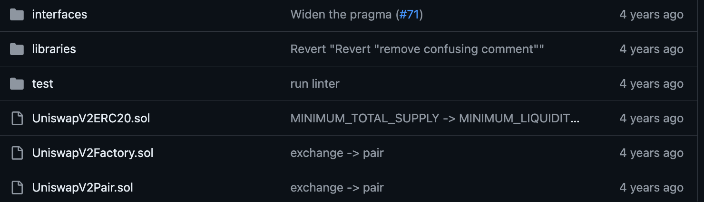
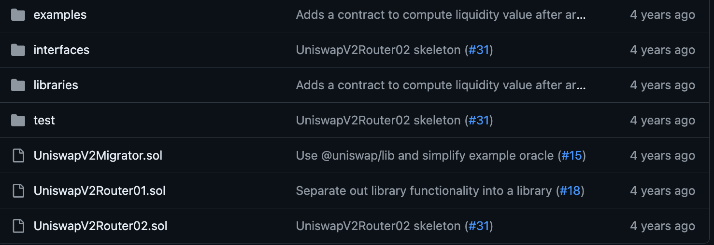

Uniswap v2 主要基于流动性池的概念。流动性提供者（LPs）将其资产（通常是两种代币）存入智能合约中形成一个交易对。这些资产存入后，合约会根据存入的比例发放代表流动性份额的LP代币给提供者。这种流动性的存入使得任何人都可以利用这些资产进行去中心化交易。

> 解释：合约会根据存入的比例发放代表流动性份额的LP代币给提供者。
> - 在 Uniswap v2 中，当流动性提供者把两种不同的代币存入到一个特定的合约中时，他们会得到一种叫做LP代币的东西。这种代币证明了他们在这个流动性池中所占的份额。比如说，如果一个流动性提供者投入了一些ETH和USDT到池子里，他们就会收到一定数量的LP代币作为回报。
> - 这些LP代币的数量是根据他们所提供的资金比例来决定的。拥有这些LP代币就像拥有一份证明，证明他们对这个池子有贡献，并且未来可以从中获得一部分交易费用作为奖励。如果他们想要拿回自己的资金，可以随时用这些LP代币来兑换回原来存入的两种代币。

交易时，交易者需要支付一定比例的交易费用，这些费用被累积在合约中，并按照LP代币的持有比例，定期分配给所有流动性提供者。这种机制鼓励了用户将资产长期存入池中，以获取交易费用作为回报。

核心合约：
`UniswapV2Pair`：这是Uniswap v2 中的核心合约。每一个“Pair”合约代表一个具体的流动性池，包含两种不同的代币。这个合约负责处理资产的存入与提取、执行交易和计算价格。它使用一个恒定乘积公式（x * y = k）来自动设置和调整交易的价格，确保交易的执行能够维持池内资产的相对价值。

# 0. 官方仓库

1. https://github.com/Uniswap/v2-core (https://github1s.com/Uniswap/v2-core)
2. https://github.com/Uniswap/v2-periphery (https://github1s.com/Uniswap/v2-periphery)

## 0.1 v2-core
  
1. **`UniswapV2ERC20.sol`**：这个合约实现了ERC20标准，专门用于管理LP（流动性提供者）代币。当用户向某个流动性池添加资金时，系统会根据添加的资金量发放相应数量的LP代币给用户，作为流动性的证明。当用户需要将自己的资金从流动性池中取出时，相应数量的LP代币会被销毁。这个过程确保了流动性的准确记录和管理。

2. **`UniswapV2Factory.sol`**：这是一个工厂合约，负责创建新的`UniswapV2Pair`合约。每当有新的代币对需要添加流动性时，这个工厂合约就会部署一个新的`UniswapV2Pair`合约实例。这个工厂合约也充当所有已部署交易对合约的注册表，记录所有存在的交易对和相应的合约地址。

3. **`UniswapV2Pair.sol`**：这个合约代表一个特定的交易对，如你所描述，Uniswap v2 中不允许同一对代币（如USDT和DAI）有多个独立的流动性池。这意味着所有向USDT和DAI池添加的流动性都会聚集在一个单一的合约中。这种设计有助于集中流动性，提高交易效率。不过，在Uniswap v3中，由于引入了更复杂的流动性管理（如不同的价格区间等），同一对代币可以有多个池子。

## 0.2 v2-periphery
是外围合约，是调用v2-core里面的合约。
  
Router合约是主要入口点，该合约的接口非常接近V1版本的交换合约。

参考文献：
1. https://space.bilibili.com/220951871/channel/collectiondetail?sid=2824381
2. https://dune-marten-78b.notion.site/85b1d29c86344112a886fcfb2ea1c44c
3. https://space.bilibili.com/475020713/channel/collectiondetail?sid=764364
4. https://github.com/cyl19970726/v2-core/blob/main/contracts/UniswapV2Pair.sol

