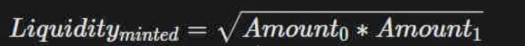
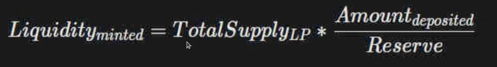
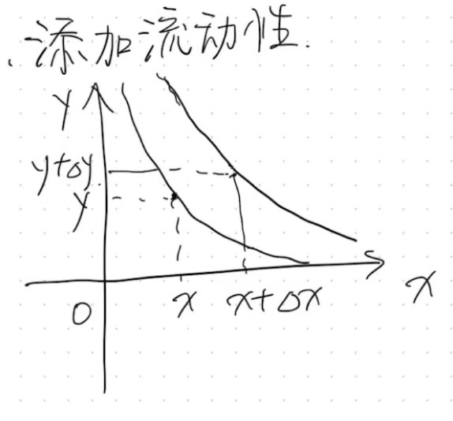
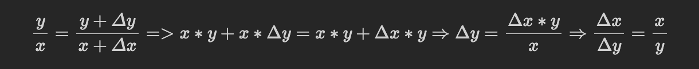
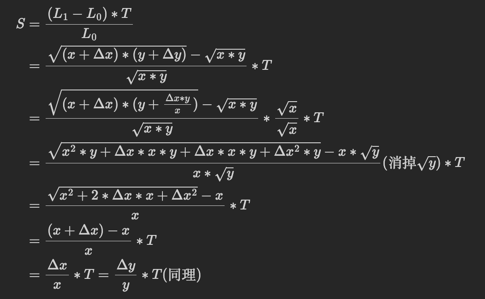
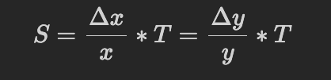
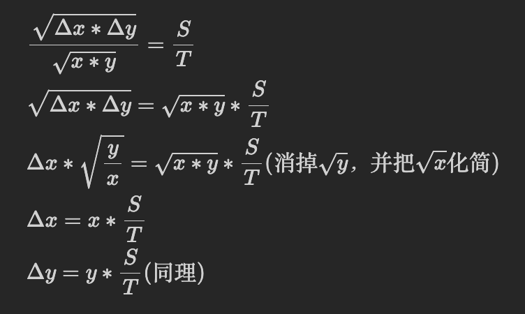
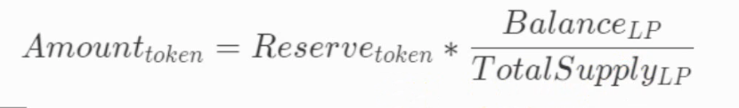
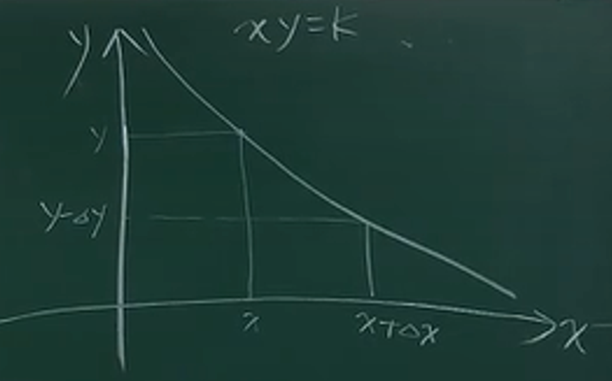

# 变量 reserve
```solidity
    address public token0;
    address public token1;

    uint112 private reserve0; // the amount of token0 in the reserve
    uint112 private reserve1; // the amount of token1 in the reserve
```

为什么在 Uniswap V2 中定义 `reserve0` 和 `reserve1` 来记录流动性池中 `token0` 和 `token1` 的数量，而不直接使用代币合约的 `balance` 方法来读取余额？
> 防止有人恶意操纵价格，隔离代币余额与交易逻辑：
> - 在 Uniswap 的设计中，流动性池的状态（即 `reserve0` 和 `reserve1`）是由智能合约内部逻辑控制的，而非直接依赖于代币合约的 `balanceOf` 方法。这意味着只有通过 Uniswap 合约定义的方法（如交换、添加或移除流动性）才能改变这些储备量。
> - 如果依赖 `balanceOf` 来动态获取储备量，那么任何能影响到代币余额的操作（比如代币合约中的特殊逻辑或其它与 Uniswap 交互的合约行为）都可能对价格造成影响。这种设计可以避免因代币余额的外部变化而无意中影响到流动性池的价格。


# mint()
在 Uniswap V2 的 `UniswapV2Pair` 合约中，`mint` 函数是用来增加流动性并发行代表该流动性的流动性提供者代币（LP 代币）的。这个过程是建立在流动性提供者已经将两种代币添加到流动性池中的基础上的。

## 计算liquidity
`在计算liquidity时`，第一次添加流动性和最后添加流动性的计算方式是不同的。
你的理解基本正确，但让我进一步详细解释第一次和之后添加流动性在 Uniswap 等自动化做市商（AMM）协议中的不同：
### 第一次添加流动性
- **定价机制**：当流动性提供者第一次向 Uniswap 池添加流动性时，他们实际上是在设置初始价格。这是因为在池子中还没有任何资产，所以提供者可以自由选择两种代币的数量比例。这个比例直接决定了这个交易对的初始价格。
- **流动性代币发行**：根据提供者投入的代币数量，Uniswap 会发行相应的流动性代币（LP 代币），这些代币代表了他们在池中的份额。第一次添加流动性的提供者通常会获得池中的初始份额。
### 之后添加流动性
- **遵循现有价格和比例**：一旦流动性池设立并且有了初始价格，后续的流动性提供者必须遵守这个已经设定的价格来添加他们的资金。这意味着，他们需要按照当前池中两种代币的数量比例（即市场价格）来投入自己的代币。
- **价格影响**：如果后续提供者按不同于当前比例的比例添加资金，他们实际上会影响池子的价格，因为这会改变两种代币的相对供应量。这可能导致暂时的套利机会，因此，理论上，流动性提供者会试图以最接近市场价格的比例添加资金，以避免造成不必要的价格偏差和个人损失。
- **流动性和价格稳定**：随着更多的资金被添加到池中，流动性增加，价格通常会变得更加稳定，因为单一交易对价格的影响减少了。

第一次的计算公式：
  
之后的计算公式：  
  

### 推导公式
首先我们要知道添加和移除流动性对价格是没有影响的。  
  
  
那么用户来添加流动性后，我们要给用户多少LPToken，即下面的$S$等于多少?
假设：
添加之前的流动性为 $L_0$ ，设添加之前的LPToken总量为T；
添加之后的流动性为 $L_1$ ，此时新mint出LPToken的数量为 $S$ ，也称为`share`的数量。
$$\frac{L_1-L_0}{L_0} = \frac{S}{T} => S = \frac{L_1-L_0}{L_0} * T$$  
式子中， $T$ 可以通过池子中的`totalSupply`查到，流动性如何用已知的变量表示？
 $L$ 和 $K$ 的关系： $L$ 的增加或减少都会影响 $K$ 的增加或减少， $L$ 的变动直接影响到 $K$ 的值， $K = X * Y => L = f(X, Y) = g(X * Y)$ 。

如果直接 $L = X * Y$ ：
1. 添加1个X，1个Y， $L = 1 * 1 = 1$ 
2. 添加10个X，10个Y， $L = 10 * 10 = 100$ 
3. 添加100个X，100个Y， $L = 100 * 100 = 10000$ 
此时L和XY的变化是二次方的比例。
2与1相差的代币数为9，但是L相差99
3与2相差的代币数为99，但是L相差9900
也就是说，此时添加的代币数和L的比例是平方的关系，而我们希望是线性的关系，因此公式为：
 $$L = \sqrt[]{X * Y}$$
 
则：
  

因此首次添加流动性：  
$$S = L = \sqrt[]{X * Y}$$  
之后再添加流动性：


### 代码
```solidity
if (totalSupply == 0) {
	liquidity = Math.sqrt(amount0 * amount1) - MINIMUM_LIQUIDITY;
	_mint(address(0), MINIMUM_LIQUIDITY);
} else {
	liquidity = Math.min(totalSupply * amount0 / _reserve0, totalSupply * amount1 / _reserve1);
}
```
第一次为什么要减去 MINIMUM_LIQUIDITY？
- **防止初始流动性被完全移除**：在 Uniswap 的设计中，`MINIMUM_LIQUIDITY` 通常被设定为一个较小的数值（比如 1000），这部分流动性代币被永久锁定在合约中，从而防止池中的流动性被完全提取。这是一个安全措施，旨在防止某些边缘情况下的操纵或技术问题，如通过移除所有流动性导致的价格失真或合约失效。
- **初始份额的永久锁定**：通过将一小部分流动性永久锁定在合约中，可以确保池子永远不会完全空置，这有助于维护合约的持续运行和功能完整性。

对于之后添加流动性算出来的liquidity为什么要取最小值？
- 按理来说，如果流动性提供者是符合我们预期来添加流动性的，那么`totalSupply * amount0 / _reserve0 == totalSupply * amount1 / _reserve1`，但其实合约是不能限制别人传进来的token数量的，也就是说，他有可能不是按比例来提供流动性的，那么只给他最小的liquidity。
- **防止价格操纵**：如果一个用户提供了一种代币的数量远远超过另一种代币的相应比例，按照较小的那个比例给予流动性代币可以防止因不平衡的贡献而造成价格操纵或不公平的流动性奖励。


# burn()
- **移除流动性**：流动性提供者（LPs）可以通过 `burn()` 函数销毁（燃烧）他们持有的流动性代币（LP 代币），以此从流动性池中提取他们所贡献的资金。这个过程实质上是交换 LP 代币回原始的质押代币（比如 ETH 和 DAI）。
- **更新内部状态**：在 `burn()` 执行的同时，合约会根据 LP 代币代表的池子份额计算并返回相应比例的两种质押代币。同时，合约内部的状态，如储备量（reserves）和总供应量（total supply），会被相应更新。
- **确保比例正确**：`burn()` 过程中，合约会确保按照流动性池当前的代币比例提取资金，这样可以保持池内价格的稳定。

计算公式：
S ：share的数量 T：移除流动性之前 Liquidity 的总量 L：Liquidity 的数量

  
  
  
用户赎回的代币数量与其持有的 LP 代币相对于池中总 LP 代币的比例成正比

代码：
```solidity
uint balance0 = IERC20(token0).balanceOf(address(this));
uint balance1 = IERC20(token1).balanceOf(address(this));

uint liquidity = balanceOf[address(this)];
amount0 = balance0 * liquidity / totalSupply;
amount1 = balance1 * liquidity / totalSupply;
```

代码是假设用户在调用burn()函数之前，已经将`LPToken`转给当前合约了，`UniswapV2Pair`合约所拥有的`LPToken`永远是0，因为它铸造的`LPToken`要么转给流动性提供者了，要么转给address(0)了，要么是`burn`了；因此这里`uint liquidity = balanceOf[address(this)];`算的其实是当前用户刚刚转入进来的`LPToken`。

# swap()

`swap()` 函数用于在 Uniswap 中交换两种不同的代币（如从 Token A 换取 Token B）。这个交换过程需要按照流动性池中的当前汇率进行，并且目标是全额兑换提交的代币数量。也就是说，如果用户想要交换 100 个 Token A，理论上交换请求是基于交换这完整的数量。

然而，由于 Uniswap 是基于自动化做市商（AMM）模型运作，实际上并不能保证每次交易都能完全按照用户提交的数量进行。这是因为交易滑点的存在——当大量交易发生时，实际的交易价格可能会因为流动性池中代币比率的变化而导致实际兑换的数量少于请求的数量。例如，在一个大量交易请求的情况下，尝试交换 100 个 Token A 可能最终只能兑换 95 个 Token A 的等价值 Token B，具体数值取决于池中的流动性和其他交易的影响。

在 Uniswap 中，用户可以设置交易的滑点容忍度，以限制因价格变动导致的交易数量减少。这通过指定最小接收数量的方式来实现，确保即使在市场波动的情况下，交换行为也能在用户可接受的范围内完成。

互换后的流动性乘积必须大于等于互换前的流动性乘积。  
  

同时在`swap`中，压根就没有考虑价格，价格是通过流动性池中两种代币的相对数量隐式决定的。

## 公式推演
### 卖出$\Delta x$，得到$\Delta y$
  
 $x_y=k$ ， $(x+\Delta x)_(y-\Delta y)=k$ ，知 $\Delta x$ ，求 $\Delta y$ 

 交换  
$$x_y =(x + \Delta x) * (y - \Delta y) = x_y + \Delta x * y - x * \Delta y - \Delta x * \Delta y$$

由上面可得，  
$$x*\Delta y + \Delta x*\Delta y = \Delta x * y \Rightarrow \Delta y = \frac{\Delta x * y}{x + \Delta x}$$

### Spot Price (现货价格)
在使用 x 交换成 y 的时候，显示的价格为 $P_0=\frac{y}{x}$，但实际成交价格为 $P_1=\frac{\Delta y}{\Delta x}$， $P_0$ 和 $P_1$ 之间的差值就是所谓的滑点  
$$x_y = (x+\Delta x)_(y-\Delta y)$$  
$$P_1 = \frac{\Delta y}{\Delta x} = \frac{y}{x+\Delta x}$$  

当 $\Delta x$ 较小时，我们可以理解为是在计算  
$$P_1 = \lim_{\Delta x \to 0}\frac{y}{x+\Delta x}$$  
可以这么理解，当池子中的x或y足够大时，那么 $\Delta x$ 就相比之下足够小，则  
$$\frac{y}{x+\Delta x} \approx \frac{y}{x} => P_1 \approx P_0$$  
此时滑点就足够小，反之亦然。

## 代码：
发送代币有两种方式：
1. `transfer`
2. `approve + transferFrom`

`uniswap`一般是使用第二种方式，第一次在`uniswap`交易的时候，需要`approve`一下，以后就不需要`approve`了；但如果是ETH就不用`approve`。

`function swap(uint amount0Out, uint amount1Out, address to, bytes calldata data) external;`
在 Uniswap 和类似的自动化做市商（AMM）系统中，`swap` 函数的参数允许进行不同的操作，包括普通的代币交换和闪电贷（flash loans）。
### `swap` 函数参数解释
- **`amount0Out` 和 `amount1Out`**: 这两个参数分别代表用户想要从流动性池中取出的两种代币的数量。在普通的代币交换操作中，通常一个参数会是非零值（表示用户希望取出的代币数量），另一个参数会是零（表示用户不希望从池中取出这种代币）。
- **`to`**: 这是代币接收地址参数，表示交换后的代币应该发送到哪个地址。
- **`data`**: 这是一个可选的数据字段，允许在交易中传递额外的数据，通常用于更高级的功能，如回调函数的执行。

### 交换与闪电贷的区别
- **普通交换**：在执行普通的交换操作时，`amount0Out` 或 `amount1Out` 中只有一个是非零值，另一个为零。这表明用户只从池中取出一种代币，而提供另一种代币以保持流动性池的恒定乘积不变。
- **闪电贷**：对于闪电贷操作，通常两个参数 `amount0Out` 和 `amount1Out` 都可能非零。这种情况下，用户从流动性池中同时取出两种代币，通常是为了在单个事务中完成一个复杂的操作序列，并且在事务结束前将代币返还，从而没有留下任何净债务。

### 交换流程

1. **授权操作**：在实际将代币 `token0` 转移到 `UniswapV2Pair` 合约之前，用户首先需要对该合约进行授权（使用 `approve` 方法）。这一步骤是必要的，因为它允许 `UniswapV2Pair` 合约能够代表用户从其账户中转出 `token0`。

2. **调用交换函数**：授权后，用户需要调用 `UniswapV2Pair` 或通过该合约提供的路由合约（通常是 `UniswapV2Router`）上的交换函数，如 `swapExactTokensForTokens`，`swapTokensForExactTokens` 等。这些函数处理交换的逻辑，包括计算价格、处理滑点以及确保交易符合当前市场条件。

3. **合约内部转账**：在交换函数内部，`UniswapV2Pair` 合约将使用用户已授权的 `token0` 代币来进行交换。用户并不需要直接将代币发送到合约地址，而是通过授权和合约内的逻辑完成这一过程。

```markdown
比如想用 `token0` 来兑换 `token1`，用户首先需要授权 `UniswapV2Pair` 合约从他们的账户中使用相应数量的 `token0`。这一步通过调用 `approve` 方法实现。授权后，用户通过调用 `UniswapV2Pair` 或相关路由合约上的交换函数（例如 `swapExactTokensForTokens`），启动交换过程。在这个过程中，合约将根据授权转移 `token0` 并根据当前流动性池的状态提供相应的 `token1`。
```

### 残缺代码
没有写闪电贷的逻辑，没有写千分之三手续费的逻辑，同时有一个漏洞，有可能转入地址的回调函数又来调用`swap()`，下面这个代码没有这个漏洞，因为我们是先更新状态，再转账，但是swap为了实现闪电贷，是先转账，再更新状态。
```solidity
    function swap(
        uint amount0Out, 
        uint amount1Out, 
        address to, 
        bytes calldata data
    ) external {
        if (amount0Out == 0 && amount1Out == 0) {
            revert InsufficientOutputAmount();
        }

        (uint112 _reserve0, uint112 _reserve1,) = getReserves(); // Determine if the reserve is sufficient
        if (amount0Out > _reserve0 || amount1Out > _reserve1) {
            revert InsufficientLiquidity();
        }

        // after swap the amount in the pool
        uint256 balance0 = IERC20(token0).balanceOf(address(this)) - amount0Out;
        uint256 balance1 = IERC20(token1).balanceOf(address(this)) - amount1Out;

        if (balance0 * balance1 < uint256(_reserve0) * uint256(_reserve1)) {
            revert InvalidK();
        }

        _update(balance0, balance1);

        // Transfer the token to the user
        require(to != token0 && to != token1 , "UniswapV2:INVALID_TO");
        if (amount0Out > 0)_safeTransfer(token0, to, amount0Out);
        if (amount1Out > 0)_safeTransfer(token1, to, amount1Out);
    }
```


