TWAP（Time Weighted Average Price，时间加权平均价格）是一种计算平均价格的方法，通过考虑时间的因素来平滑价格波动，常用于如Uniswap这样的DeFi平台上。在面对大规模交易时，TWAP有助于提供一个更稳定的价格指标。

由于区块链（链上）与现实世界（链下）之间本质上不直接互通，因此需要预言机（Oracle）来传递链下数据到链上。Oracle或预言机的作用是将链下的信息，如市场价格，可靠地传输到区块链网络中。然而，由于存在操纵数据的潜在利益，单一数据源的预言机可能面临被攻击或误导的风险。
因此，使用去中心化的预言机，如Chainlink，可以通过集成多个数据源和验证节点来减少这种风险。Chainlink通过其去中心化的结构，难以受到攻击，但在理想情况下，最安全的方法是使用完全基于链上数据的价格预言机，以消除对链外数据的依赖。

## 计算公式：
$P_n$ 是在 $t_n$ 时间点的价格
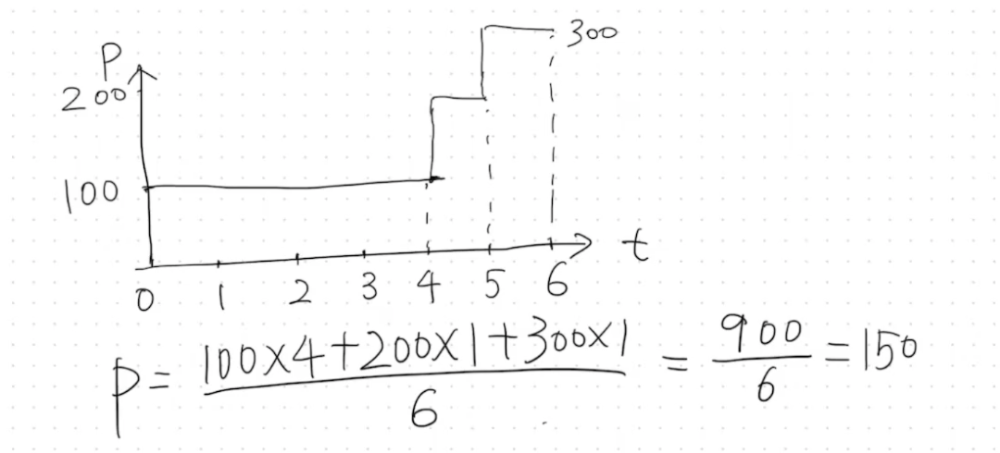  
站在第6秒，算过去两秒的平均价格：
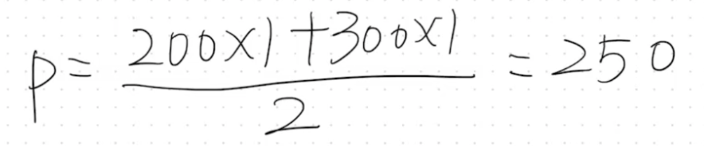  
站在第6秒，算过去1秒的平均价格：
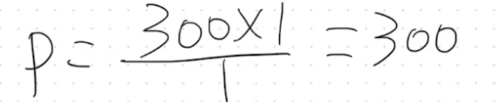  

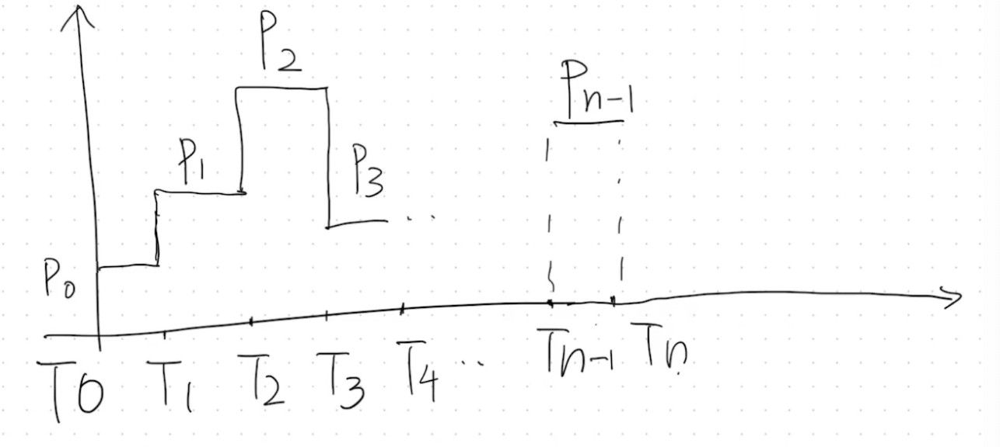  
由上面可得，  
$$p = \frac{\sum_{i=0}^{n-1}P_i*(T_{i+1}-T_i)}{T_n-T_0}$$  

假如我们想要从 $t_k$ 计算，而不是从 0 计算
$$P = \frac{\sum_{i=k}^{n-1}P_i*(T_{i+1}-T_i)}{T_n-T_k} = \frac{\sum_{i=0}^{n-1}P_i*(T_{i+1}-T_i) - \sum_{i=0}^{k-1}P_i*(T_{i+1}-T_i)}{T_n-T_k}$$

## 合约代码
```solidity
uint public blockTimestrampLast;
uint public price0CumulativeLast;
uint public price1CumulativeLast;
```
1. `uint public blockTimestampLast`
这个变量存储了最后一次交易或状态更新发生时的区块时间戳。

2. `uint public price0CumulativeLast`
这个变量是代币0相对于代币1的累积价格的最后记录值。在 Uniswap 中，价格是通过流动性池中两种代币的相对数量计算得出的。`price0CumulativeLast` 变量记录了从合约部署开始到最后一次状态更新为止，代币0的价格累积值。

3. `uint public price1CumulativeLast`
类似于 `price0CumulativeLast`，这个变量是代币1相对于代币0的累积价格的最后记录值。它记录了合约部署后代币1价格的累积值。这也用于时间加权平均价格的计算，帮助平滑短期价格波动，并提供一个基于历史数据的更稳定价格估计。


在pair中，两个token的余额发生变化的时候，就会发生更新，而`mint` `burn` `swap` 都会去调用`_update`函数，这个函数在每次交易后调用，用于计算和更新这些累积价格，基于自合约启动以来的所有时间：
```solidity
function _update(uint balance0, uint balance1, uint112 _reserve0, uint112 _reserve1) private {
	require(balance0 <= uint112(-1) && balance1 <= uint112(-1), 'UniswapV2: OVERFLOW');
	uint32 blockTimestamp = uint32(block.timestamp % 2**32);
	uint32 timeElapsed = blockTimestamp - blockTimestampLast; // overflow is desired
	if (timeElapsed > 0 && _reserve0 != 0 && _reserve1 != 0) {
		// * never overflows, and + overflow is desired
		price0CumulativeLast += uint(UQ112x112.encode(_reserve1).uqdiv(_reserve0)) * timeElapsed;
		price1CumulativeLast += uint(UQ112x112.encode(_reserve0).uqdiv(_reserve1)) * timeElapsed;
	}
	reserve0 = uint112(balance0);
	reserve1 = uint112(balance1);
	blockTimestampLast = blockTimestamp;
	emit Sync(reserve0, reserve1);
}
```


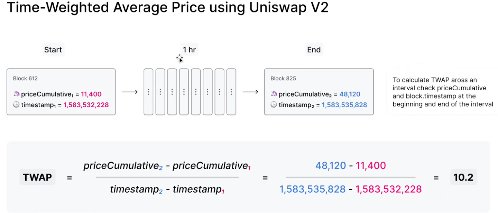  
在第612个区块中，记录$priceCumulative_1 = 11400$
一小时后，$priceCumulative_2 = 48120$
那么过去一小时的平均价格就是 10.2

在 Uniswap V2 中，平台本身并不直接提供一个现成的、可直接调用的 TWAP（时间加权平均价格）功能。相反，Uniswap V2 提供了必要的工具和数据（如 `price0CumulativeLast` 和 `price1CumulativeLast`），使得用户或开发者可以自行计算 TWAP。

代码：
`../OpenSpace_Homework/W5D2/uniswap_v2_rewrite/src/tools/UniswapV2TWAP.sol`

### 代码的介绍
您使用 Uniswap V2 和 TWAP (时间加权平均价格) 合约时的一般步骤：
1. 在 Pair 合约中进行操作
首先，确实需要在 Uniswap V2 的 Pair 合约中进行一些交易操作，如 `mint`、`burn` 或 `swap`。这些操作会改变流动性池的状态，并更新累积价格。

2. 部署 TWAP 合约
部署 TWAP 合约通常是在已经有一些交易活动发生后进行的。当部署此合约时，它会初始化并存储当前的累积价格和最后一个区块时间戳（即最后一次`pair._update`的时间）。这些初始值将用作后续计算的基准。

3. 等待一段时间
必须等待设定的时间周期（PERIOD），之后才能执行价格更新操作。这个等待周期是为了确保计算的平均价格反映了足够的市场动态，从而减少潜在的价格操纵风险。

4. 调用 update 函数
一旦超过了设定的时间周期（PERIOD），就可以调用 `TWAP.update()` 函数来计算新的时间加权平均价格。这个函数会比较当前的累积价格与上次保存的累积价格，基于这两个值和时间间隔计算新的平均价格。计算完毕后，合约会更新存储的累积价格和时间戳，为下一周期的计算做准备。

==第一次调用的话==，时间加权平均价格（TWAP）的计算基于两个关键时间点：合约部署时从交易对（pair）获取的时间戳 $T1$ 以及之后调用 `update` 函数时的时间戳 $T2$。
时间点定义：
- **$T1$**: 是部署 TWAP 合约时从 Uniswap V2 Pair 合约获取的最后一次交易更新的时间戳。这是通过调用如 `getReserves()` 这样的函数获取的，该函数返回的一部分数据包括最后的时间戳。
- **$T2$**: 是调用 `update` 函数时的当前区块时间戳。
 TWAP 计算
   - 使用 $T1$ 和 $T2$ 之间的累积价格差异来计算平均价格。$T1$ 时刻的累积价格为 `priceCumulativeLast`，而 $T2$ 时刻的累积价格为当前从 `UniswapV2OracleLibrary.currentCumulativePrices` 获取的值，那么这段时间内的价格变化量为 `priceCumulative - priceCumulativeLast`。
   - 计算公式为： $$\text{priceAverage} = \frac{\text{priceCumulative} - \text{priceCumulativeLast}}{T2 - T1}$$

==之后的调用为==：在时间点 $T3$ 再次调用 `update` 函数时，用于计算新的时间加权平均价格（TWAP）的时间段将是 $T3 - T2$。这里的 $T2$ 是上一次调用 `update` 函数时记录的时间戳，而 $T3$ 是当前调用 `update` 时的区块时间戳。

 5. 使用 consult 函数查询价格

# 演示
## 部署
### tokenA: address: 0x6159650574988d6b9051c0B7D89bb00c59390eF7
```shell
➜  uniswap_v2_rewrite git:(main) ✗ forge create --rpc-url sepolia --account Dylan_5900 TokenA
[⠊] Compiling...
[⠰] Compiling 7 files with Solc 0.8.26
[⠔] Solc 0.8.26 finished in 311.58ms
Compiler run successful!
Enter keystore password:
Deployer: 0x3A8492819b0C9AB5695D447cbA2532b879d25900
Deployed to: 0x6159650574988d6b9051c0B7D89bb00c59390eF7
Transaction hash: 0x0e1e85a4e70035584483047264324aa2b8b1af01f1bab8be859e5150e55b0363
```

### tokenB: address: 0x29175991c5A876f3323523333D7dC10234B02064
```shell
➜  uniswap_v2_rewrite git:(main) ✗ forge create --rpc-url sepolia --account Dylan_5900 TokenB
[⠊] Compiling...
[⠢] Compiling 1 files with Solc 0.8.26
[⠰] Solc 0.8.26 finished in 196.05ms
Compiler run successful!
Enter keystore password:
Deployer: 0x3A8492819b0C9AB5695D447cbA2532b879d25900
Deployed to: 0x29175991c5A876f3323523333D7dC10234B02064
Transaction hash: 0xbec1fcdad179751a032990ca4b32969b0cf2889395ae24ff4d563ec138877544
```

## mint 1e26 & approve 1e26
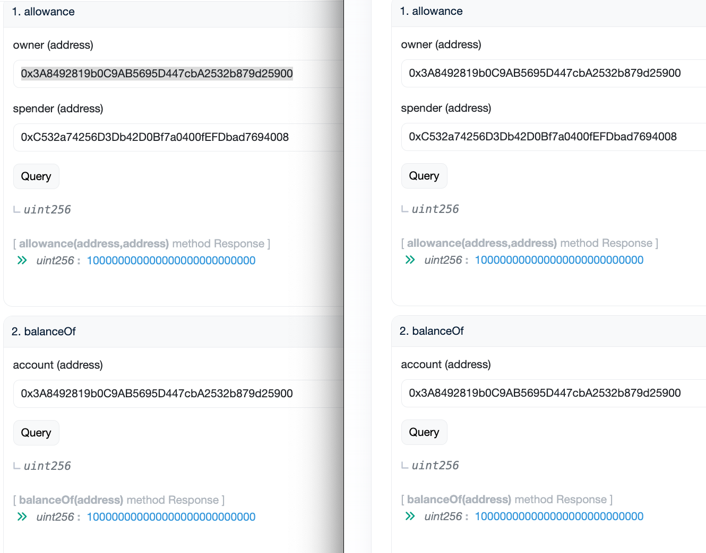  

## 在Router2合约中创建pair
router2地址：0xC532a74256D3Db42D0Bf7a0400fEFDbad7694008  
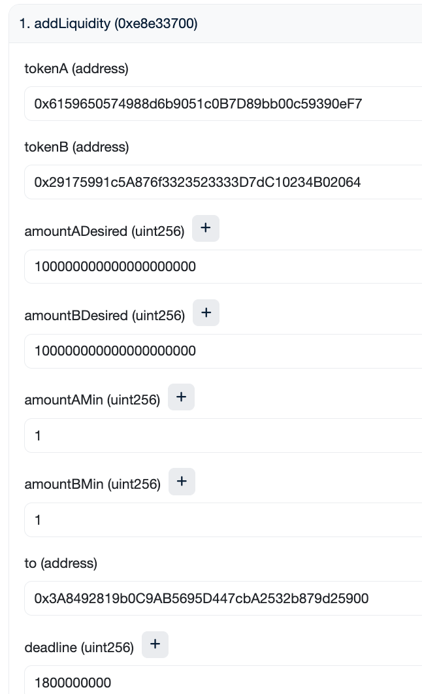  
交易链接：https://sepolia.etherscan.io/tx/0x1c759d22ff861d2fb1c72abd873f2a52923ede9b7f5e6e565b5ff06756c2b943
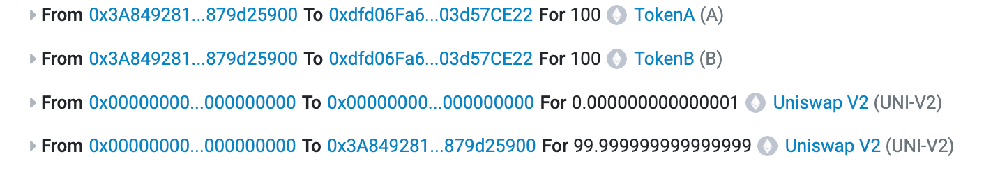  
给我`100e18`个LPT，转给`address(0)` 1000个LPT
新创建的pair地址（自动验证）：0xdfd06Fa639245c28e880aDe396Abd1003d57CE22  
  
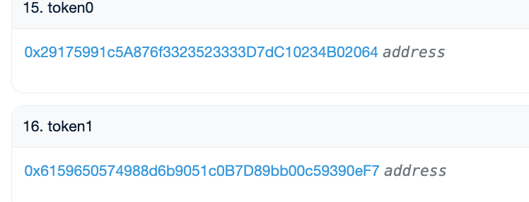  
==地址反过来了，好像是根据地址的大小排序的。
现在
token0: 0x29175991c5A876f3323523333D7dC10234B02064
token1: 0x6159650574988d6b9051c0B7D89bb00c59390eF7==

## 【错误】部署TWAP: address : 0x997e44962bb09509e1f33b7e4960b28be37f9cde
下来的代码有问题，可以直接跳转到[[#【正确】重新部署TWAP：address 0x9e859C00E679871A55051160F103A190665332F7]]
```shell
➜  uniswap_v2_rewrite git:(main) ✗ forge create --rpc-url sepolia --account Dylan_5900 UniswapV2TWAP --constructor-args 0xdfd06Fa639245c28e880aDe396Abd1003d57CE22
[⠊] Compiling...
No files changed, compilation skipped
Enter keystore password:
Deployer: 0x3A8492819b0C9AB5695D447cbA2532b879d25900
Deployed to: 0x997e44962bb09509e1f33b7e4960b28be37f9cde
transaction hash: 0x5b607b1435c3d1b7a1489346833f6bf064d0c2c2911cb831eda2beef66770b2a
```
合约一直验证不通过，使用remix，同时将间隔时间改为10秒

初始状态：  
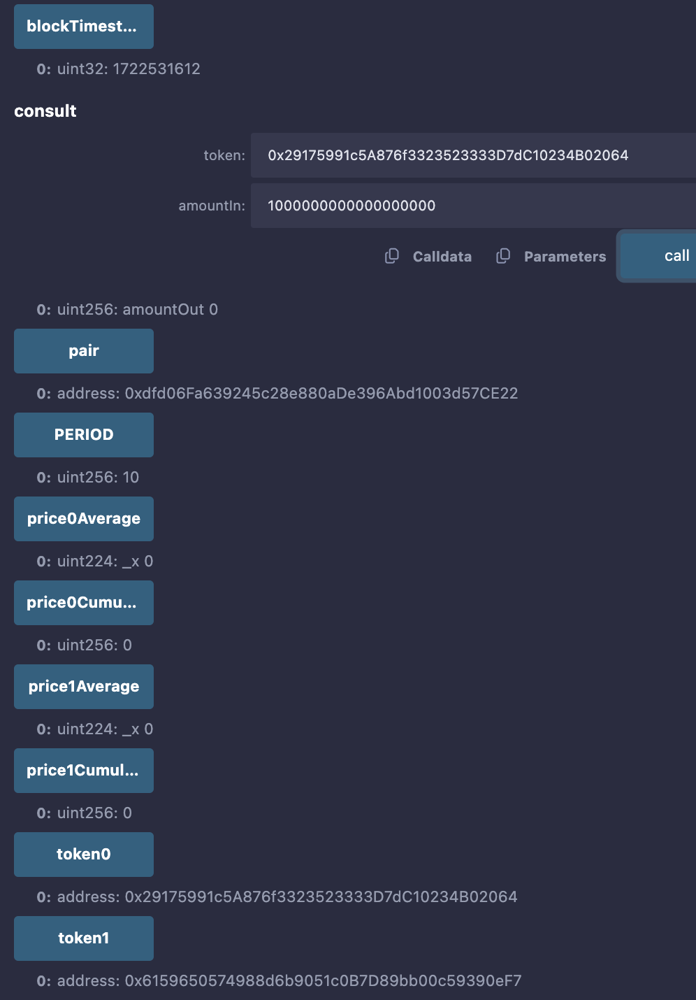  
 此时的blockTimestampLast 就是池子第一次创建出来的时间，也就是第一次update的时间。

更新后：  
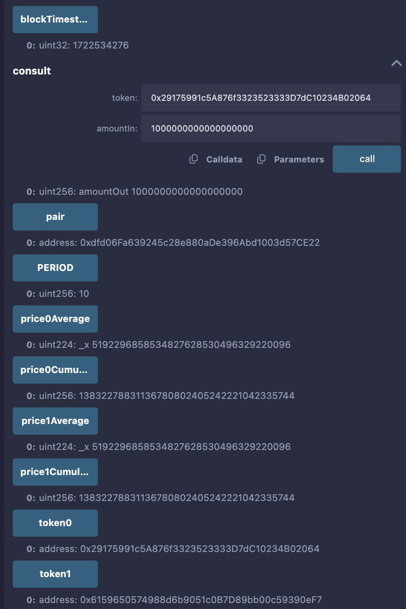  

### 卖掉100个token1，获得50个token0
`swapExactTokensForTokens` 用于执行确切数量的代币交换操作。这个函数使用户能够指定一个确切的输入代币数量，并获取一定数量的输出代币，这些代币数量基于当前的池中流动性和价格自动计算。

1. **amountIn**: 用户想要交换的确切代币数量。
2. **amountOutMin**: 用户接受的最少输出代币数量。这个参数为了用户安全，以避免在交易确认前市场价格变动造成的不利影响。
3. **path**: 代币交换路径数组。这个数组定义了交易从输入代币到输出代币的路径，路径上的每个代币对应一个 Uniswap V2 池，决定了用户希望卖出哪种代币（Token）并购买哪种代币。
4. **to**: 代币接收地址。
5. **deadline**: 交易截止时间。如果交易在这个时间前没有被矿工确认，则交易会被回退，保证交易在特定时间内完成或失效。
  
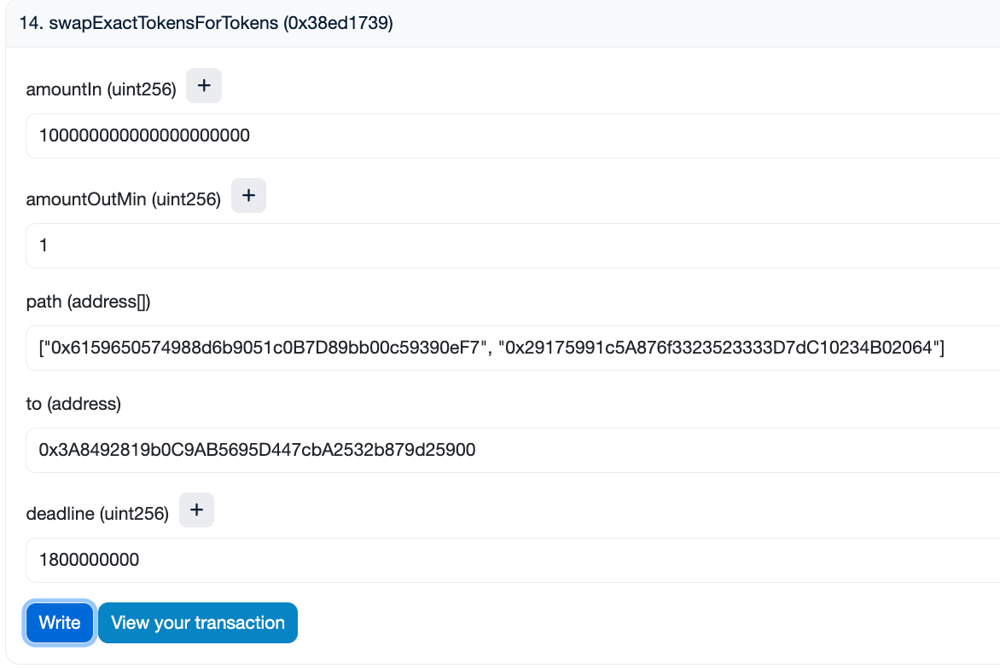  
这里我是卖出`100个 token1(tokenA): 0x6159... `来换取`token0(tokenB): 0x2917...
`
交易：https://sepolia.etherscan.io/tx/0xdebc3fe332caedd2118d93e27b5f343b44dd0d9ab83b27bb3b2a2aad4cdafb6c
  
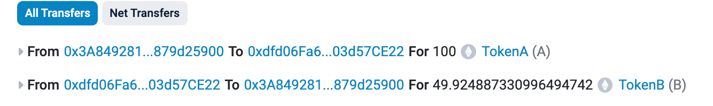  

看池子：  
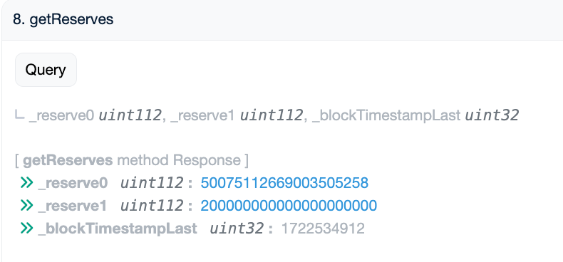  
可以看出现在1个`token0`价值4个`token1`

### TWAP.update()
按理说是 4倍，算的有问题：  
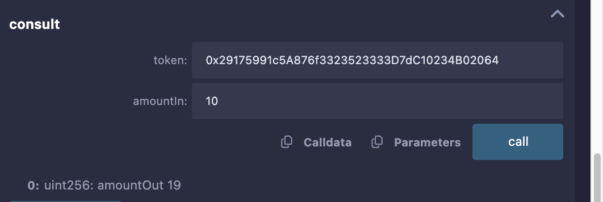  

## 【正确】重新部署TWAP：address: 0x9e859C00E679871A55051160F103A190665332F7
修改了老版本的代码。
- Babylonian：`uniswap_v2_rewrite/src/libraries/v2-periphery-libraries/Babylonian.sol`
- BitMath: `uniswap_v2_rewrite/src/libraries/v2-periphery-libraries/BitMath.sol`
- FixedPoint: `uniswap_v2_rewrite/src/libraries/v2-periphery-libraries/FixedPoint.sol`
- FullMath: `uniswap_v2_rewrite/src/libraries/v2-periphery-libraries/FullMath.sol`
- UniswapV2Pair: `uniswap_v2_rewrite/src/interfaces/IUniswapV2Pair.sol`
- UniswapV2Library: `uniswap_v2_rewrite/src/interfaces/IUniswapV2Pair.sol`
- UniswapV2OracleLibrary: `uniswap_v2_rewrite/src/libraries/v2-periphery-libraries/UniswapV2OracleLibrary.sol`
- UniswapV2TWAP: `uniswap_v2_rewrite/src/tools/UniswapV2TWAP.sol`

	这时候再去测:
	1e18个 `token0` 需要 `3993999999999999999 (4e18)`个 `token1` 去换  
	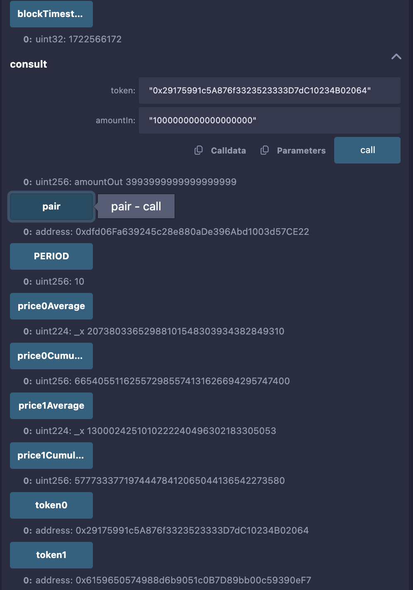  


	1e18 个 token1 需要 `250375563345017526 (25e16)` 个 `token0` 去换  
	  

