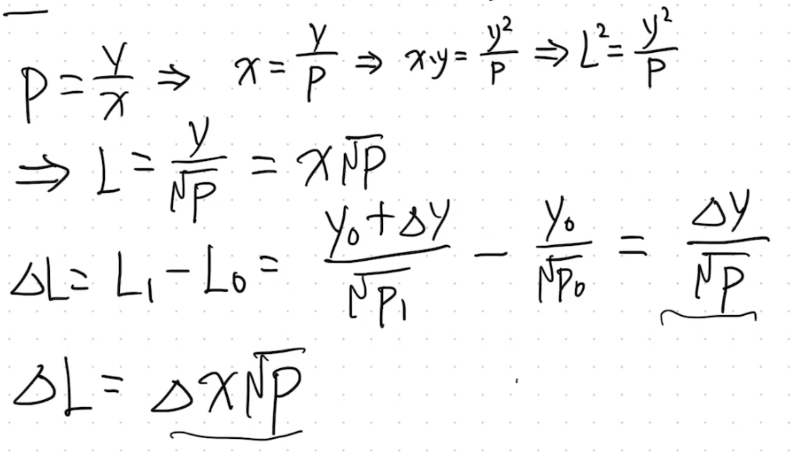
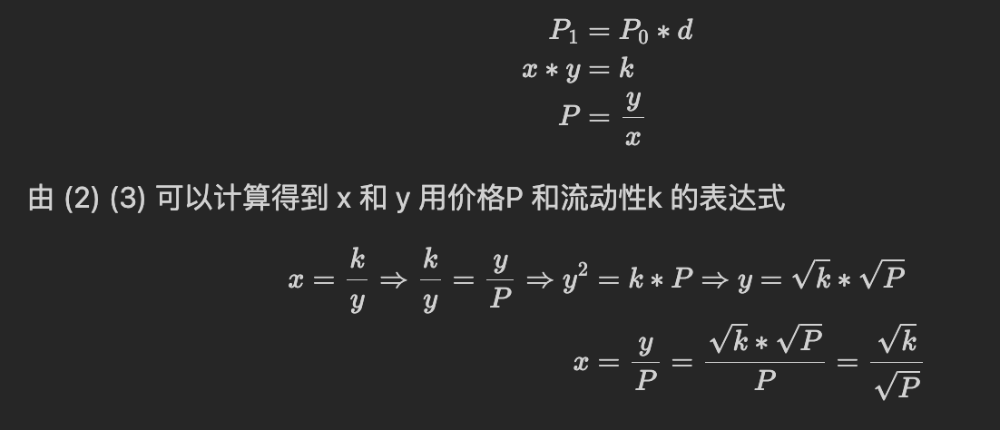
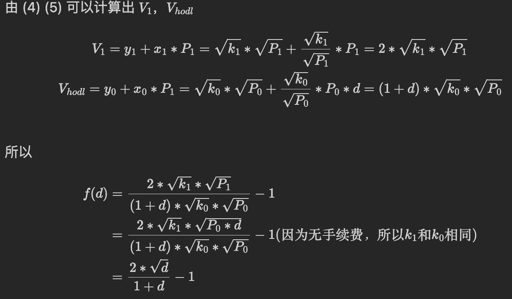
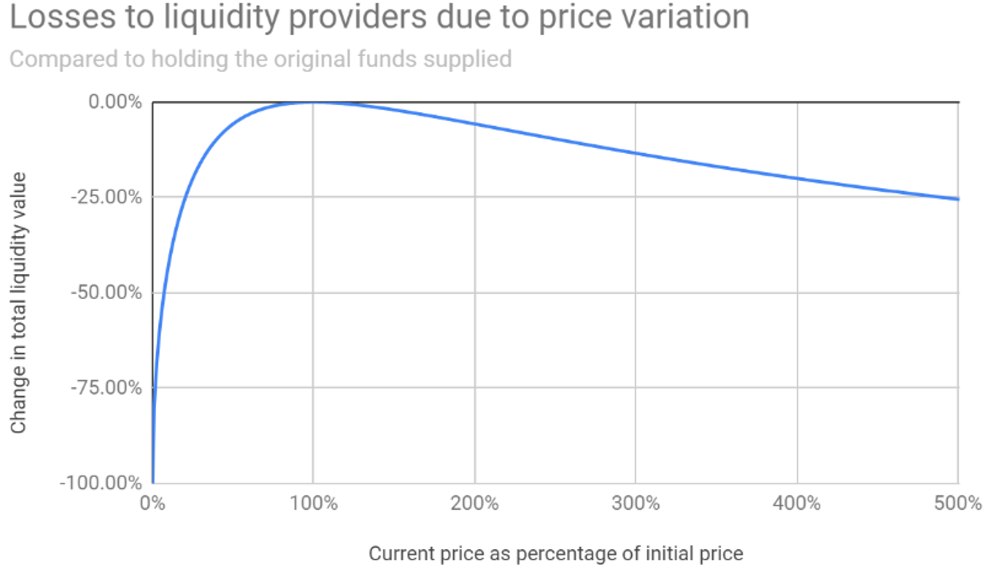

无常损失是出现在添加/移除流动性的情况下，而滑点是出现在两个代币交换的情况下。

$x * y = k = L^2 => L = \sqrt{x * y}$  
一个交易对中，有`tokenA`和`tokenB`，如果我们想知道一个token的价格，是用另一个token的数量除以这个token的数量。
比如要知道x的价格， $P = \frac{y}{x}$  

假设一开始为 $t_0$、 $x_0$ 、 $y_0$ 、 $P_0=\frac{y_0}{x_0}$ 、 $L_0 = \sqrt{x_0 * y_0}$  

添加流动性（无手续费）之后为 $t_1$ 、 $x_1 = x_0 + \Delta x$ 、 $y_1 = y_0 +\Delta y$ 、 $P_1=\frac{y_1}{x_1}$ , $L_1 = \sqrt{(x_0 + \Delta x) * (y_0 * \Delta y)}$ 。  
那么 $\Delta L = L_1 - L_0 = ？$ （用 $\Delta x$ 或 $\Delta y$ 和P来表示，用P是因为==添加流动性前后的价格是不变的==， $P_0 = P_1$ ；==swap前后，即价格涨幅前后，L是不变的==）  
  
上面是增加流动性时， $\Delta L 和 \Delta x 、 \Delta y$ 的关系。

## 案例
假设我们有一个初始 LP 为：100DAI：1ETH，此时 K = 100， $P_{ETH}=\frac{100}{1}=100$ ，两个代币总价值为 100 + 100 = $200

- 当 ETH 涨价时，LP 为：120DAI：0.83ETH，此时 K 不变， $P_E=\frac{120}{0.83}=144.58$ ，两个代币总价值为 120 + 120 = $240，但如果我们并没有添加流动性而是拿住最开始的 100DAI 和 1ETH，两个代币总价值为 100 + 1 * 144.58 = $244.58，那么 244.58 与 240 的差值就是无常损失的值.

- 当 ETH 降价时，LP 为：80DAI：1.25ETH，此时 K 不变， $P_E=\frac{80}{1.25}=64$ ，两个代币总价值为 80 + 80 =$160，但如果我们并没有添加流动性而是拿住最开始的 100DAI 和 1ETH，两个代币总价值为 100 + 1 * 64 = $164，那么 164 与 160 的差值就是无常损失的值

即在添加流动性所产生的无常损失会导致 ETH 涨价时相比拿住赚得更少，ETH 降价时相比拿住亏得更多。

## 量化无常损失
通过上面的例子我们可以抽象出更通用的模型，我们可以列出下面这三个公式， $P_i$ 表示在 i 时刻某个代币的价格，d 表示价格变化的因素 (当 $0 \lt d \lt 1$ 时表示降价， $d=1$ 时表示价格不变， $d \gt 1$ 时表示涨价)  

假设一开始为 $t_0$ 、 $x_0$ 、 $y_0$ 、 $P_0=\frac{y_0}{x_0}$  

添加流动性（无手续费）之后为 $t_1$ 、 $x_1$ 、 $y_1$ 、 $P_1=\frac{y_1}{x_1}$  

拿住为 $t_{hodl}$ 、 $x_0$ 、 $y_0$ 、 $P_1=\frac{y_1}{x_1}$  

将无常损失与价格变化之间的关系函数设为 $f(d)$，V 表示为代币的 value，则
$$f(d)=\frac{做LP的损失}{拿住之后的价值}=\frac{V_1-V_{hodl}}{V_{hodl}}=\frac{V_1}{V_{hodl}}-1$$

Uniswap 官方文档中给出的[无常损失与价格变化的关系曲线](https://docs.uniswap.org/contracts/v2/concepts/advanced-topics/understanding-returns)  
  
在100%，价格不变，之后无论上涨还是下跌，都会有无常损失；如果价格下跌，那么LP就会跌的更惨，上涨的话，就只会跌一点点。

 

